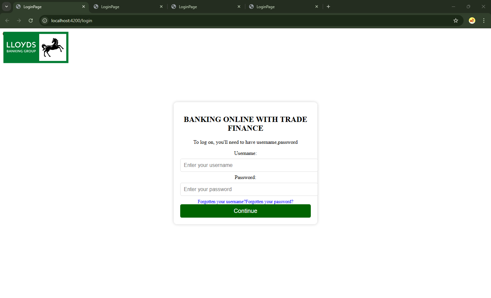

# IBillExchange

When working with the Corda platform, every transaction is stored in the participants'
vaults. The vault is a where all the transactions involving the owner are securely saved.
Each vault is unique and accessible only by its owner,
serving as a ledger to track all the owner's transactions.


This repo is the usecase of using RLN DLT Network using Corda 2.5 for Bill of Exchange Settlement. The members are already registered. The can login via login pages.

## Setup

### Backend
1. Clone repository [`https://github.com/sanskriti-ltc/corda-transactions`](https://github.com/sanskriti-ltc/corda-transactions)
2. Install `java17`
3. Install `corda-cli 5.2.0.0`
4. Change the corda cli path in [docker-compose](config\combined-worker-compose.yaml)
5. run command:
```shell
docker-compose -f .\config\combined-worker-compose.yaml up --build
```
6. Run the command
```shell
./gradlew clean build
./gradlew tasks
./gradlew vNodesSetup
```
7. Run following command to get all vNodes info
```shell
./gradlew listVNodes
```
8. API list will be available at [`https://localhost:8888/api/v5_2/swagger#`](https://localhost:8888/api/v5_2/swagger#)

# Frontend
1. Clone repository [`https://github.com/priyankasahu23/IBillExchange`](https://github.com/priyankasahu23/IBillExchange)
2. Open cloned repo in terminal
3. go to the `ui` folder
```
cd ui
```
4. Run `docker-compose` command
```
docker-compose up --build -d
```
5. Open UI in the browser  [`https://localhost:4200`](https://localhost:4200)

## Pages

### Login page

The members in RLN DLT Network can login here. The members registered in this demo are:<br>

| Role            | Name           | Description                              | Username | Password |
|-----------------|----------------|------------------------------------------|----------|----------|
| Seller          | Global Exports | An Enterprise with account in LBG Bank   | lbguser  | lbg123   |
| Buyer           | ABC Imports    | An Enterprise with account in ICICI Bank | sbiuser  | sbi123   |
| Compliance Bank | RBI            | The regulatory bank of India             | rbi      | rbi123   |



### Seller Dashboard

Here, Seller can see the tokens in their vault in form of a table.<br>


To create a new transaction, the seller can click on the `+ Create Transaction Request` Button, a form will appear as shown below:<br>


### Buyer Dashboard

Here, Buyer can see the tokens in their vault in form of a table.<br>


To approve a token, the buyer can click on the `Approve` Button, a status window will appear with option to Approve/Reject the token or Close the window:<br>


### Compliance Dashboard

Here, Compliance/Regulatory Bodies can see the tokens in their vault in form of a table.<br>


The can verify if the transactions and Bill of Exchange in the form of tokens, are as per the regulations and guidelines.